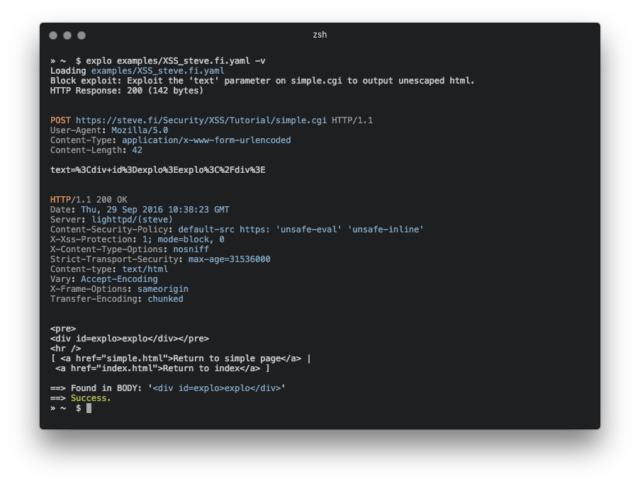

# explo



`explo` is a simple tool to describe web security issues in a human and machine readable format.
By defining a request/condition workflow, `explo` is able to exploit security issues without the
need of writing a script. This allows to share complex vulnerabilities in a simple readable and executable format. 

Example for extracting a csrf token and using this in a form:
```yaml
name: get_csrf
description: extract csrf token
module: http
parameter:
    url: http://example.com/contact
    method: GET
    header:
        user-agent: Mozilla/5.0
    extract:
        csrf: [CSS, "#csrf"]
---
name: exploit
description: exploits sql injection vulnerability with valid csrf token
module: http
parameter:
    url: http://example.com/contact
    method: POST
    body:
        csrf: "{{get_csrf.extracted.csrf}}"
        username: "' SQL INJECTION"
    find: You have an error in your SQL syntax
```

# Table of contents

 - [Installation](#installation)
 - [Usage](#usage)
 - [Modules](#modules)
   - [HTTP (Basic)](#http-basic)
   - [HTTP (Header)](#http-header)
   - [SQLI (Blind)](#sqli-blind)

In this example definition file the security issue is tested by executing two steps which are run from top to bottom. The last step returns a success or failure, depending on the string 'You have an error in your SQL syntax' to be found.

## Installation

### Install via PyPI

    pip install explo

### Install via source

    git clone https://github.com/dtag-dev-sec/explo
    cd explo
    python setup.py install

## Usage

    explo [--verbose|-v] testcase.yaml
    explo [--verbose|-v] examples/*.yaml

There are a few example testcases in the `examples/` folder.

    $ explo examples/SQLI_simple_testphp.vulnweb.com.yaml

You can also include explo as a python lib:

```python
from explo.core import from_content as explo_from_content
from explo.core import ExploException, ProxyException

def save_log(msg):
    print(msg)

try:
    result = explo_from_content(explo_yaml_file, save_log)
except ExploException as err:
    print(err)
```

## Modules

Modules can be added to improve functionality and classes of security issues.

### http (basic)

The http modules allows to make a http request, extract content and search/verify content. 

The following data is made available for following steps:

* the http response body: `stepname.response.content` 
* the http response cookies: `stepname.response.cookies`
* extracted content: `response.extracted.variable_name`

If a `find_regex` parameter is set, a regular expression match is executed on the response body. If this fails, this module returns a failure and thus stopping the executing of the current workflow (and all steps).

When extracting by regular expressions, use the match group `extract` to mark the value to extract (view below for an example).

For referencing cookies, reference the name of the previous step where cookies should be taken from (`cookies: the_other_step.response.cookies`).

Parameter examples:

```yaml
parameter:
    url: http://example.com
    method: GET
    allow_redirects: True
    headers:
        User-Agent: explo
        Content-Type: abc
    cookies: stepname.response.cookies
    body:
        key: value
    find: search for string
    find_regex: search for (reg|ular)expression
    find_in_headers: searchstring in headers
    extract:
        variable1: [CSS, '#csrf']
        variable2: [REGEX, '<input(.*?)value="(?P<extract>.*?)"']
```

### http\_header

The http header module allows to check if a response misses a specified set of headers (and values). All other parameters are *identical* to the http module.

The following data is made available for other modules:

* the http response body: `stepname.response.content` 
* the http response cookies: `stepname.response.cookies`

Parameter examples:

```yaml
parameter:
    url: http://example.com
    method: GET
    allow_redirects: True
    headers:
        User-Agent: explo
        Content-Type: abc
    body:
        key: value
    headers_required:
        X-XSS-Protection: 1
        Server: .               # all values are valid
```

### sqli\_blind

The sqli\_blind module is able to identify time based blind sql injections.

The following data is made available for other modules:

* the http response body: `stepname.response.content` 
* the http response cookies: `stepname.response.cookies`

Parameter examples:

```yaml
parameter:
    url: http://example.com/vulnerable.php?id=1' waitfor delay '00:00:5'--
    method: GET
    delay_seconds: 5
```

If the threshold of 5 seconds (delay\_seconds) is exceeded, the check returns true (and thus resulting in a success).
